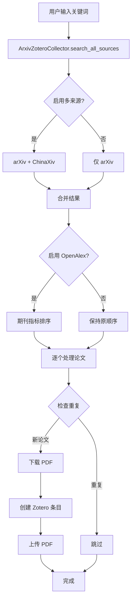

# 项目架构 | Project Architecture

本文档详细说明 arxiv-zotero-connector 的系统架构、设计决策和代码组织。

This document details the system architecture, design decisions, and code organization of arxiv-zotero-connector.

---

## 🏗️ 系统架构 | System Architecture

### 整体架构图 | Overall Architecture

```
┌─────────────────────────────────────────────────────────────┐
│                     用户接口层 | User Layer                  │
│  ┌──────────────────┐  ┌──────────────────┐  ┌─────────────┐│
│  │  CLI (cli.py)    │  │  Scripts         │  │  Examples   ││
│  │  -m arxiv_zotero │  │  - auto_collect  │  │  - tutorials ││
│  │                  │  │  - search_papers │  │             ││
│  └──────────────────┘  └──────────────────┘  └─────────────┘│
└─────────────────────────────────────────────────────────────┘
                              │
                              ▼
┌─────────────────────────────────────────────────────────────┐
│                   核心业务层 | Core Layer                    │
│  ┌──────────────────────────────────────────────────────┐   │
│  │         ArxivZoteroCollector (connector.py)          │   │
│  │  - 协调各组件 | Orchestrates all components           │   │
│  │  - 搜索论文 | Searches papers                         │   │
│  │  - 处理论文 | Processes papers                        │   │
│  └──────────────────────────────────────────────────────┘   │
│                              │                               │
│         ┌────────────────────┼────────────────────┐         │
│         ▼                    ▼                    ▼         │
│  ┌─────────────┐    ┌──────────────┐    ┌────────────┐    │
│  │ PaperSearch │    │ PaperProcess │    │  Ranking   │    │
│  │             │    │              │    │            │    │
│  │ - arXiv     │    │ - Duplicate  │    │ - OpenAlex │    │
│  │ - ChinaXiv  │    │ - PDF        │    │ - Journal  │    │
│  └─────────────┘    └──────────────┘    └────────────┘    │
└─────────────────────────────────────────────────────────────┘
                              │
                              ▼
┌─────────────────────────────────────────────────────────────┐
│                   服务层 | Service Layer                     │
│  ┌─────────────┐  ┌──────────────┐  ┌──────────────────┐   │
│  │ ArxivClient │  │ ChinaXiv     │  │  OpenAlexClient  │   │
│  │             │  │ Client       │  │                  │   │
│  │ - 搜索 API  │  │ - 搜索 API   │  │ - 期刊指标查询   │   │
│  │ - 元数据    │  │ - 元数据     │  │ - 缓存管理       │   │
│  └─────────────┘  └──────────────┘  └──────────────────┘   │
│                                                                  │
│  ┌──────────────────────────────────────────────────────┐   │
│  │              ZoteroClient                             │   │
│  │  - 论文上传 | Upload items                           │   │
│  │  - PDF 附件 | Attach PDFs                            │   │
│  │  - 查重检测 | Duplicate detection                    │   │
│  └──────────────────────────────────────────────────────┘   │
└─────────────────────────────────────────────────────────────┘
                              │
                              ▼
┌─────────────────────────────────────────────────────────────┐
│                   工具层 | Utility Layer                     │
│  ┌──────────────┐  ┌─────────────┐  ┌─────────────────┐    │
│  │ PDFManager   │  │ Credentials  │  │ JournalRanker   │    │
│  │              │  │              │  │                 │    │
│  │ - 下载       │  │ - 安全存储   │  │ - 综合评分      │    │
│  │ - 上传       │  │              │  │ - 排序算法      │    │
│  └──────────────┘  └─────────────┘  └─────────────────┘    │
└─────────────────────────────────────────────────────────────┘
                              │
                              ▼
┌─────────────────────────────────────────────────────────────┐
│                   配置层 | Config Layer                      │
│  ┌──────────────┐  ┌──────────────┐  ┌──────────────────┐   │
│  │ MetadataMap  │  │ BilingualCfg │  │  ArxivConfig     │   │
│  │              │  │              │  │                  │   │
│  │ - 字段映射   │  │ - 双语关键词 │  │ - 搜索参数       │   │
│  └──────────────┘  └──────────────┘  └──────────────────┘   │
└─────────────────────────────────────────────────────────────┘
```

---

## 📦 模块详解 | Module Details

### 1. 客户端模块 (clients/)

#### ArxivClient
**职责**: 与 arXiv API 交互

**核心功能**:
- `search_arxiv()`: 根据 keywords 搜索论文
- `parse_arxiv_xml()`: 解析 arXiv Atom 响应
- `extract_paper_metadata()`: 提取论文元数据

**API 限制**:
- 无速率限制（但建议礼貌使用）
- 支持布尔查询
- 支持时间过滤

#### ChinaXivClient
**职责**: 与 ChinaXiv API 交互

**核心功能**:
- `search_chinaxiv()`: 搜索中文预印本
- `parse_chinaxiv_response()`: 解析响应
- 支持中英文关键词

**注意事项**:
- API 不稳定，有降级机制
- 编码处理（UTF-8）

#### OpenAlexClient
**职责**: 查询期刊影响力指标

**核心功能**:
- `query_by_doi()`: 通过 DOI 查询
- `query_by_journal_name()`: 通过期刊名查询
- `auto_preload_common_journals()`: 自动预加载缓存
- 本地缓存管理

**查询策略**:
1. DOI 查询（最准确）
2. 期刊名查询（降级）
3. 默认分数（保底）

**缓存机制**:
- 文件: `config/journal_metrics_cache.json`
- 命中率可达 60-80%
- 速度提升 70-90%

#### ZoteroClient
**职责**: 与 Zotero API 交互

**核心功能**:
- `create_item()`: 创建文献条目
- `attach_pdf()`: 上传 PDF 附件
- `check_duplicate()`: 查重检测
- 速率限制保护

**优化**:
- 集合内查重（更快）
- 批量操作
- 错误重试

---

### 2. 核心模块 (core/)

#### ArxivZoteroCollector
**职责**: 主连接器，协调所有组件

**核心工作流**:
```python
1. search_all_sources()  # 搜索论文
   ↓
2. rank_papers_with_openalex()  # 排序（可选）
   ↓
3. process_paper()  # 逐个处理
   ├─ check_duplicate()
   ├─ download_pdf()
   ├─ create_zotero_item()
   └─ attach_pdf()
```

**关键方法**:
- `search_all_sources()`: 多来源搜索
- `run_collection_async()`: 异步采集流程
- `rank_papers_with_openalex()`: OpenAlex 排序

#### PaperProcessor
**职责**: 论文处理流程

**处理步骤**:
1. 元数据映射（arXiv → Zotero 格式）
2. 查重检测（全局或集合内）
3. PDF 下载
4. Zotero 条目创建
5. PDF 附件上传

**错误处理**:
- 降级策略
- 详细的日志记录
- 失败重试

#### SearchParams
**职责**: 搜索参数封装

**支持的参数**:
- `keywords`: 搜索关键词列表
- `max_results`: 最大结果数
- `start_date` / `end_date`: 时间过滤
- `sort_by`: 排序方式

---

### 3. 配置模块 (config/)

#### MetadataMapper
**职责**: arXiv 到 Zotero 的字段映射

**映射关系**:
| arXiv 字段 | Zotero 字段 | 说明 |
|-----------|-------------|------|
| title | title | 标题 |
| authors | creators | 作者（转换格式） |
| published | date | 发表日期 |
| summary | abstractNote | 摘要 |
| journal_ref | publication | 期刊信息 |
| doi | DOI | DOI |
| arxiv_id | archiveLocation | arXiv ID |

#### BilingualConfig
**职责**: 双语关键词配置

**配置格式**:
```yaml
sources:
  arxiv:
    keywords:
      general: '"autonomous driving" OR "intelligent vehicles"'
  chinaxiv:
    keywords:
      general: '"自动驾驶" OR "智能网联汽车"'
```

---

### 4. 工具模块 (utils/)

#### PDFManager
**职责**: PDF 下载和管理

**功能**:
- 下载 PDF 到临时目录
- 文件大小检查（限制 50MB）
- 清理临时文件

#### JournalRanker
**职责**: OpenAlex 指标综合评分

**评分公式**:
```
score = 0.50 * percentile_norm +
        0.30 * h_index_norm +
        0.20 * impact_factor_norm
```

**归一化方式**: min-max normalization

#### Credentials
**职责**: 安全的凭证管理

**功能**:
- 从环境变量读取
- 从 .env 文件读取
- 提供默认值

---

## 🔄 数据流 | Data Flow

### 典型工作流 | Typical Workflow



---

## 🎨 设计模式 | Design Patterns

### 1. 策略模式 (Strategy Pattern)

**OpenAlex 查询策略**:
- 策略 1: DOI 查询
- 策略 2: 期刊名查询
- 策略 3: 默认分数

### 2. 适配器模式 (Adapter Pattern)

**元数据映射**:
- arXiv 格式 → Zotero 格式
- 统一接口

### 3. 单例模式 (Singleton Pattern)

**HTTP Session**:
- 复用连接
- 提高性能

### 4. 工厂模式 (Factory Pattern)

**客户端创建**:
- 根据配置创建不同客户端
- 统一初始化流程

---

## 🔒 安全考虑 | Security Considerations

### 1. API 密钥管理
- 使用环境变量
- `.env` 文件（不提交到 Git）
- 提供 `.env.example` 模板

### 2. 速率限制
- Zotero API: 严格限制
- OpenAlex API: 礼貌延迟（0.3秒）
- arXiv API: 无硬性限制

### 3. 输入验证
- 关键词验证
- 文件大小限制
- 日期范围检查

---

## 🚀 性能优化 | Performance Optimizations

### 1. 缓存策略
- **OpenAlex 缓存**: 本地 JSON 文件
- **命中率**: 60-80%
- **提速**: 70-90%

### 2. 异步操作
- 异步 HTTP 请求
- 并发 PDF 下载
- 非阻塞 API 调用

### 3. 批量处理
- 批量查询
- 减少往返次数

### 4. 降级机制
- API 失败 → 使用缓存
- 缓存未命中 → 使用默认值
- 保证系统稳定性

---

## 📊 扩展点 | Extension Points

### 1. 添加新的论文来源
继承 `BaseClient`（如果有的话）或参考 `ChinaXivClient` 实现

### 2. 自定义排序器
继承 `JournalRanker` 并重写 `calculate_composite_score()`

### 3. 自定义元数据映射
修改 `MetadataMapper` 或提供新的映射类

### 4. 集成其他工具
- AI 摘要生成（已有 `summarizer.py`）
- 自动分类（可以添加）
- 去重算法改进

---

## 🧪 测试策略 | Testing Strategy

### 单元测试
- 客户端测试
- 工具类测试
- 配置解析测试

### 集成测试
- 完整工作流测试
- API 集成测试

### 测试位置
```
tests/
├── test_clients/        # 客户端测试
├── test_core/           # 核心逻辑测试
├── test_utils/          # 工具类测试
└── integration/         # 集成测试
```

---

## 📝 代码规范 | Code Style

### Python 风格
- PEP 8
- 类型提示（Type Hints）
- 文档字符串（Docstrings）

### 命名约定
- 类名: `PascalCase`
- 函数/变量: `snake_case`
- 常量: `UPPER_SNAKE_CASE`

### 注释
- 中英文双语注释
- 详细的函数文档
- 使用示例

---

## 🔮 未来改进 | Future Improvements

### 短期 (1-2个月)
- [ ] 添加更多测试覆盖
- [ ] 性能分析和优化
- [ ] 更详细的错误消息

### 中期 (3-6个月)
- [ ] 插件系统
- [ ] 更多数据源支持
- [ ] Web UI

### 长期 (6个月+)
- [ ] 分布式处理
- [ ] 机器学习集成
- [ ] 云端同步

---

**最后更新**: 2026-01-22
**维护者**: [Stepan Kropachev](https://github.com/StepanKropachev)
